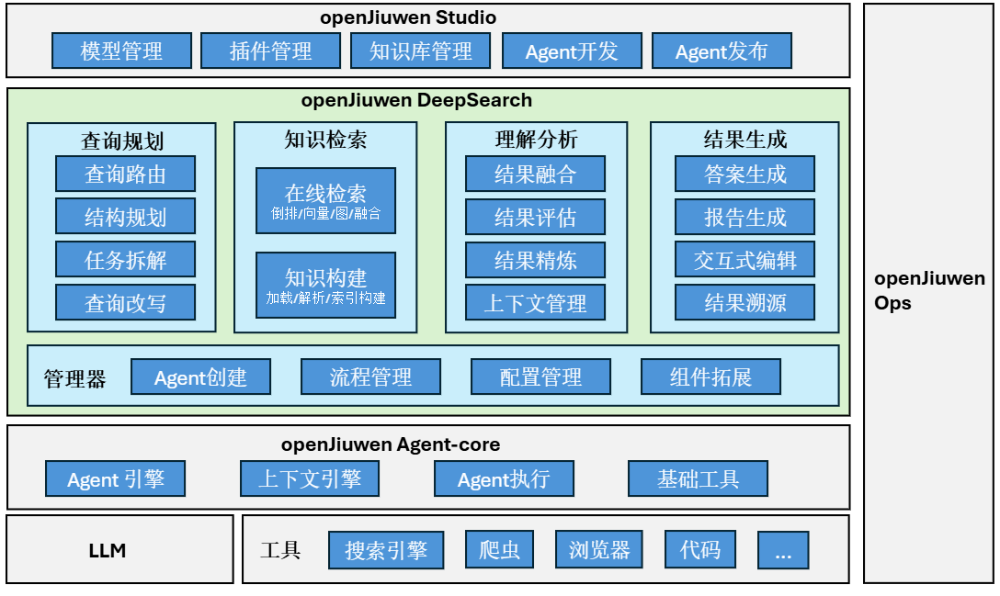

# 🔬 什么是openJiuwen-DeepSearch

**openJiuwen-DeepSearch** 是一款知识增强高性能、高精准深度检索与研究引擎。目标是有效利用结构化知识及大模型，融合各种工具，提供企业级Agentic AI 搜索及研究能力。本系统以openJiuwen agent-core能力为基础，构建了包含查询规划、信息收集、理解反思、报告生成等多agent协同处理能力，解决复杂推理问题及研究任务。 

## 应用场景
openJiuwen-DeepSearch面向企业与消费者提供深度搜索与深度研究能力。 本版本提供深度研究能力，解决专业或高风险决策等场景中需要多步骤、多源验证、逻辑严谨、结构化输出的任务需求。
 - 金融分析研报： 支持对接本地投资与金融知识库、网页搜索引擎能力，针对投资及金融分析研究工作（如：“美联储2025年降息对A股科技板块的影响”），进行任务规划、信息获取及分析，并生成投资及金融研报。
 - 学术与政策研究： 支持对接本地或通用搜索引擎获取相关政策信息、实施细则等，通过任务规划，信息收集及分析，生成报告，如：“中国‘新质生产力’政策对制造业中小企业的影响”。

## 核心特性
- **基于样例的报告生成**
    + 支持给定报告模板、或样例报告提取模板，并基于此模板生成相似报告。
    + 样例报告支持Markdown、HTML、Word、PDF等多种格式，模板可输出。

- **知识增强融合检索**
    + 支持基于关键词、向量、图及融合检索的本地知识库接入。
    + 支持本地知识库与通用网页的融合检索。
    + 支持在线的动态知识构建、评估、精炼，提升融合搜索结果质量并降低上下文消耗。

- **协同可交互**
    + 支持在规划阶段与用户进行自然语言式反馈交互。
    + 依据用户反馈进行协同式修改。

- **片段级结果溯源**
    + 输出结果及报告内容具有经过校验的引用信息，引用信息可预览并跳转。
    + 支持片段级信息溯源及溯源可信度。
    + 支持核心内容观点的溯源推理及可视化展示。

- **图文并茂报告生成**
    + 支持包含图文可视化报告生成，报告内容可溯源。
    + 支持Markdown形式输出及word、html等多种报告格式转换。


## 系统架构

openJiuwen-DeepSearch的系统架构如下图所示。openJiuwen-DeepSearch主要基于openJiuwen agent-core构建，可以对接不同大模型及工具能力。
DeepSearch主要由管理器、查询规划、信息收集、理解分析和内容生成等部分组成，其中：


- **管理器**：提供基于openJiuwen agent-core框架进行Agent创建、编排流程管理、配置管理等能力。支撑智能体之间任务实现合理配合及高效运作。
- **查询规划**：提供基于意图识别的查询路由、结构规划、任务分解、查询改写等查询理解功能，实现对用户真实意图的捕捉及任务编排。
- **知识检索**：提供离线知识构建与在线检索两大功能。其中离线部分包含文档的解析、切分及不同类型的知识索引构建；在线检索支持基于关键词的倒排检索、向量检索、知识图谱检索及融合检索等多种模式；同时支持对接不同的网页搜索能力。
- **理解分析**：提供对检索结果及其他上下文信息的理解能力。主要包含对搜索结果进行评估、精炼、扩展、融合等功能。 
- **结果生成**：提供答案、报告生成、交互式编辑及结果溯源等主要功能。

openJiuwen Studio作为一站式AI Agent开发平台，提供了从开发到部署的全站解决方案。openJiuwen-DeepSearch作为典型Agent实现，可以在Studio平台进行
模型、工具及知识库等管理及配置，同时输入用户查询，体验深度研究的过程及报告结果。而openJiuwen Ops作为AI Agent从调试、评测、到观测、调优等一站式平台，可辅助openJiuwen-DeepSearch等Agent进行调试调优。

为方便叙述，后面将采用以下简称：
- **agent-core**: openJiuwen agent-core
- **Studio**: openJiuwen Studio
- **DeepSearch**: openJiuwen-DeepSearch
- **Ops**: openJiuwen Ops

# 📦 安装指导
**Linux 系统快速安装**

### 1. 下载版本包（若已获取版本包跳过此步骤）

* 根据机器架构下载版本包：

  - 下载 x86_64 架构版本包
    ```
    wget https://openjiuwen-ci.obs.cn-north-4.myhuaweicloud.com/agentstudio/deployTool_0.1.3_amd64.zip
    ```

  - 下载 arm 架构版本包：
    ```
    wget https://openjiuwen-ci.obs.cn-north-4.myhuaweicloud.com/agentstudio/deployTool_0.1.3_arm64.zip
    ```

### 2. 启动 DeepSearch

* 将版本包放至安装目录。

* 安装 unzip 工具
  ```bash
  sudo apt update && sudo apt install unzip -y
  ```

* 解压对应的架构版本包。
  - 解压 x86_64 架构版本包
    ```
    unzip deployTool_0.1.3_amd64.zip
    ```

  - 解压 arm 架构版本包
    ```
    unzip deployTool_0.1.3_arm64.zip
    ```

* 进入 *deployTool_0.1.3_xxx64* 目录，输入以下命令确认 Docker 已启动：

  ```bash
  sudo systemctl start docker
  sudo systemctl status docker
  ```
  
* 输入以下命令启动 DeepSearch：

  ```bash
  ./service.sh up
  ```

更多安装方式请参考[安装指导](./docs/zh/2.安装指导/快速指引.md)。

# 🚀 快速上手
**视频教程**

更多操作详见[快速上手](./docs/zh/3.快速上手/3.快速上手.md)。

# 💻 开发指南
想利用 DeepSearch 源码进行开发，请参考[源码结构](./docs/zh/4.开发指南/directory_structure.md)，期待您的加入。

# ❓ FAQ
更多常见问题详见[FAQ](./docs/zh/5.FAQ/README.md)。

# ⚖️ 许可证
本项目采用 Apache 2.0 许可证。详见 [LICENSE](LICENSE) 文件。

# 🤝 贡献方式
欢迎提交 Issue 和 Pull Request！详情请参考[贡献指南](https://www.openjiuwen.com/contribute)。
