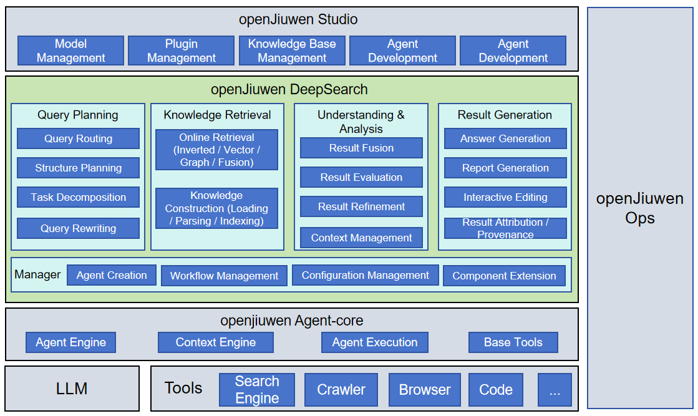

**Read this in:** English | [简体中文](./README_zh.md)

<h1 align="center">openJiuwen Search</h1>

This repository hosts openJiuwen retrieval products and their shared foundation:

| Path | Package | What it is |
|---|---|---|
| [`deepsearch/`](./deepsearch/) | **openJiuwen-DeepSearch** | Knowledge-augmented deep research / report generation |
| [`codesearch/`](./codesearch/) | **openJiuwen-CodeSearch** | Agentic code-repository retrieval (issue → files/lines) |
| [`base/`](./base/) | **openjiuwen-search-base** | Shared primitives (LLM, embedding, Milvus, workflow helpers) used by the products above |

- DeepSearch details: this README (below) and [`deepsearch/README.md`](./deepsearch/README.md)
- CodeSearch details: [`codesearch/README.md`](./codesearch/README.md) · [中文](./codesearch/README_zh.md)
- Shared base details: [`base/README.md`](./base/README.md)

# 🔬 What is openJiuwen-DeepSearch?

<p align="center">
  <strong>Comprehensive intelligent search solutions from deep research to code search</strong>
</p>

<p align="center">
  <a href="LICENSE">
    
  </a>
  
  
</p>


# Introduction

**openJiuwen Search** is a collection of search capabilities within the openJiuwen open-source project, providing comprehensive intelligent search solutions from deep research to code search. This repository brings together multiple search agents targeting different scenarios, aiming to deliver enterprise-grade Agentic AI search capabilities to enterprises and developers.

---

## Subprojects

### DeepSearch - Deep Retrieval and Research Engine

**DeepSearch** is a knowledge-augmented, high-performance, high-precision deep retrieval and research engine. It leverages structured knowledge and large language models with various tools to deliver enterprise-grade Agentic AI search and research capabilities.

**Core capabilities:**
- **Deep Research**: Multi-step, multi-source validated, rigorously reasoned structured research report generation
- **Deep Search**: Intelligent Q&A based on state-space search with multi-step reasoning and tool calling
- **Knowledge-augmented hybrid retrieval**: Fusion of local knowledge bases (keyword, vector, graph retrieval) with web-augmented engines
- **Rich reports with visuals**: Report generation with embedded figures and charts, fully traceable content
- **Segment-level provenance**: Outputs with validated citations, supporting segment-level traceability and confidence assessment
- **Collaborative and interactive**: Natural-language feedback during the planning phase

**Use cases:**
- Financial analysis reports: Connect local investment and finance knowledge bases to generate investment and financial research reports
- Academic and policy research: Gather policy information and implementation details, then generate research reports
- Complex query search: Solve professional decision-making scenarios requiring multi-step, multi-source validation

**Documentation:** [DeepSearch project docs](./deepsearch/README.md)

---

### CodeSearch - Code Search Agent

**CodeSearch** is an intelligent retrieval engine for code repositories. Given a problem description (e.g. a GitHub Issue, bug report, or feature request), it outputs "which files and which lines to look at to resolve it," providing precise code context for bug localization, code Q&A, and automated repair pipelines.

**Core capabilities:**
- **Agentic multi-round retrieval**: The retrieval agent makes autonomous decisions (browsing repo structure, multi-strategy search, expanding context, filtering commits), with dual-model collaboration to control costs
- **Code-oriented hybrid indexing**: Syntax-aware chunking (currently Python), dual-sparse BM25, incremental indexing with optional dense vector retrieval
- **Dual-engine equivalent implementation**: Workflow graph engine (default) + pure-code loop engine, with tests locking byte-identical output
- **Service-oriented engineering**: SDK, CLI, HTTP service, and container image form factors

**Use cases:**
- Bug localization: Turn an Issue into specific functions and code lines that need modification
- Code Q&A context supply: Provide line-precise code evidence for questions like "where is this feature implemented"
- Large repository navigation: Exchange natural language for relevant code slices in unfamiliar large codebases

**Quick start:** [CodeSearch quick start guide](./codesearch/docs/en/2.Installation%20Guide/Quick%20Start.md)

**Documentation:** [CodeSearch project docs](./codesearch/README.md)

---

### openjiuwen-search-base - Shared Search Foundation Library

**openjiuwen-search-base** is the **shared foundation layer** for the openJiuwen search product family, providing reusable LLM integration, vector retrieval, workflow, and other base components for DeepSearch, CodeSearch, and other products. This package has no dependencies on any product package; its core depends only on pydantic, with heavier dependencies offered as optional groups using guarded imports that can be enabled on demand.

**Core modules:**
- **llm**: LLM client protocol, standardized models for messages and tool calls, openJiuwen model adapter (with SSL certificate handling), `LLMConfig`
- **embedding**: OpenAI-compatible embedding client with local SQLite caching, limited retries with exponential backoff, persistent connection reuse
- **milvus**: Safe query expression construction (unified escaping), collection naming conventions (product prefix + schema version), general-purpose storage client
- **workflow**: Workflow node templates (three-phase) and branch routing construction
- **logging_utils**: Log management and sensitive information masking
- **runtime**: Run registry, passed via run_id through workflows; live objects never enter copyable workflow state

**Design principles:**
- **Dependency direction**: base depends on no product package; products depend on base
- **Optional heavy dependencies**: Core import paths never touch openjiuwen / pymilvus / aiohttp; pure logic parts remain importable and testable without the optional groups installed
- **Namespace isolation**: Collection names follow `{prefix}{name}__{schema_version}` format, allowing multiple products to safely share the same Milvus instance

**Quick install:**
```sh
pip install -e .                            # core
pip install -e '.[workflow,milvus,embed]'   # enable extras on demand
```

**Documentation:** [base project docs](./base/README.md)

---

## Quick Start

### DeepSearch quick start

#### SDK installation

For secondary development, customized deployment, or source-level debugging:

- [DeepSearch SDK installation guide](./deepsearch/docs/en/2.Installation%20Guide/DeepSearch_SDK/README.md)

**Recommended model configuration:**
- **Verified models**: Qwen3.7-Max (recommended), Qwen3.8-Flash, Qwen3.7-Plus, Qwen3-Max, GLM-5.3, GLM-5.3-Flash, GLM-5.2, GLM-5.1, GLM-5, DeepSeek V3.2, Kimi-K2.5
- **Tip**: Use more capable models for report generation to balance output quality and call stability
- **Note**: When using reasoning models, report generation time increases significantly; if speed matters, prefer non-reasoning models

### CodeSearch quick start

```
# Index a local repository
pip install -e ../base -e '.[dev,milvus,llm,server]'
codesearch index --repo /path/to/your/repo --collection my_repo

# Search with natural language (configure CODESEARCH_LLM_API_KEY etc. in .env)
codesearch search --collection my_repo --query "TypeError when calling foo() with empty list"
```

Detailed usage guide: [CodeSearch quick start](./codesearch/docs/en/3.Quick%20Start/3.Quick%20Start.md)

---

## Documentation navigation

### DeepSearch docs

- [Product overview](./deepsearch/docs/en/1.Product%20Introduction/1.Product%20Introduction.md) - Product positioning and core features
- [Installation guide](./deepsearch/docs/en/2.Installation%20Guide/Quick%20Guide.md) - Detailed installation and configuration
- [Developer guide](./deepsearch/docs/en/3.Developer%20Guide/README.md) - Developer documentation
- [FAQ](./deepsearch/docs/en/4.FAQ/README.md) - Frequently asked questions

### CodeSearch docs

- [Product overview](./codesearch/docs/en/1.Product%20Introduction/1.Product%20Introduction.md) - Product positioning and core features
- [Installation guide](./codesearch/docs/en/2.Installation%20Guide/README.md) - Detailed installation and configuration
- [Quick start](./codesearch/docs/en/3.Quick%20Start/3.Quick%20Start.md) - Get started quickly
- [Developer guide](./codesearch/docs/en/4.Developer%20Guide/README.md) - Developer documentation
- [FAQ](./codesearch/docs/en/5.FAQ/README.md) - Frequently asked questions

### base docs

- [openjiuwen-search-base](./base/README.md) - Module and design documentation for the shared foundation library

---

## System architecture

### DeepSearch architecture overview

DeepSearch is built mainly on openJiuwen agent-core and can connect to different LLMs and tools. The system consists of the following components:



- **Manager**: Agent creation, workflow orchestration, and configuration management on the agent-core framework
- **Query planning**: Intent-based routing, structural planning, task decomposition, query rewriting, and other query understanding capabilities
- **Knowledge retrieval**: Offline knowledge construction and online retrieval, supporting multiple retrieval modes
- **Understanding and analysis**: Understanding of retrieval results and other contextual information, including evaluation, refinement, expansion, and fusion
- **Result generation**: Answers, report generation, interactive editing, and result provenance

### CodeSearch architecture overview

```
┌──────────── Indexing (offline) ────────────────┐
│  Code repo → Syntax-aware chunking → Milvus     │
│  dual-sparse index · Incremental: file hash     │
│  dedup, unchanged files shared across versions  │
└─────────────────────────────────────────────────┘
┌──────────── Retrieval (online) ─────────────────┐
│  Problem description → Retrieval agent          │
│  (decision model · filter model · segment       │
│   memory · five tool types) → files + line      │
│   ranges                                        │
└─────────────────────────────────────────────────┘
```

---

## Contributing

Contributions of code, bug reports, and feature ideas are welcome!

- Submit Issues and Pull Requests
- See the [contribution guide](https://www.openjiuwen.com/en/contribute)
- Join community discussions

---

## License

This project is licensed under **Apache 2.0**. See the [LICENSE](./LICENSE) file.

---

## Contact

- **Project homepage**: [https://github.com/openJiuwen-ai/deepsearch](https://github.com/openJiuwen-ai/deepsearch)
- **Official website**: [https://www.openjiuwen.com/en/](https://www.openjiuwen.com/en/)
- **Issue tracker**: [Issues](https://github.com/openJiuwen-ai/deepsearch/issues)

---

## Disclaimer

This product serves as a workflow orchestration tool only and does not include AI model capabilities. Users are responsible for compliance with applicable regulations such as the EU AI Act when connecting AI models for specific business scenarios.

---

**If this project is helpful to you, please give us a Star! Your support is our motivation for continuous improvement!**