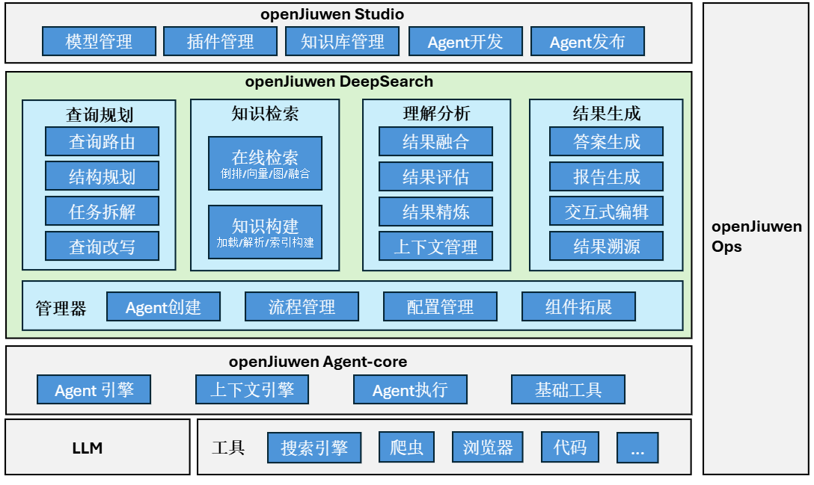

**阅读语言：** [English](./README.md) | 简体中文

# 🔬 什么是openJiuwen-DeepSearch

**openJiuwen-DeepSearch** 是一款知识增强高性能、高精准深度检索与研究引擎。目标是有效利用结构化知识及大模型，融合各种工具，提供企业级Agentic AI 搜索及研究能力。本系统以openJiuwen agent-core能力为基础，构建了包含查询规划、信息收集、理解反思、报告生成等多agent协同处理能力，解决复杂推理问题及研究任务。 

## 应用场景
openJiuwen-DeepSearch面向企业与消费者提供深度搜索与深度研究能力。 本版本提供深度研究能力，解决专业或高风险决策等场景中需要多步骤、多源验证、逻辑严谨、结构化输出的任务需求。
 - 金融分析研报： 支持对接本地投资与金融知识库、联网增强引擎能力，针对投资及金融分析研究工作（如：“美联储2025年降息对A股科技板块的影响”），进行任务规划、信息获取及分析，并生成投资及金融研报。
 - 学术与政策研究： 支持对接本地或联网增强引擎获取相关政策信息、实施细则等，通过任务规划，信息收集及分析，生成报告，如：“中国‘新质生产力’政策对制造业中小企业的影响”。

## 核心特性
- **基于样例的报告生成**
    + 支持给定报告模板、或样例报告提取模板，并基于此模板生成相似报告。
    + 样例报告支持Markdown、HTML、Word、PDF等多种格式，模板可输出。

- **知识增强融合检索**
    + 支持基于关键词、向量、图及融合检索的本地知识库接入。
    + 支持本地知识库与通用网页的融合检索。
    + 支持在线的动态知识构建、评估、精炼，提升融合搜索结果质量并降低上下文消耗。

- **协同可交互**
    + 支持在规划阶段与用户进行自然语言式反馈交互。
    + 依据用户反馈进行协同式修改。

- **片段级结果溯源**
    + 输出结果及报告内容具有经过校验的引用信息，引用信息可预览并跳转。
    + 支持片段级信息溯源及溯源可信度。
    + 支持核心内容观点的溯源推理及可视化展示。

- **图文并茂报告生成**
    + 支持包含图文可视化报告生成，报告内容可溯源。
    + 支持Markdown形式输出及word、html等多种报告格式转换。

## 系统架构

openJiuwen-DeepSearch的系统架构如下图所示。openJiuwen-DeepSearch主要基于openJiuwen agent-core构建，可以对接不同大模型及工具能力。
DeepSearch主要由管理器、查询规划、信息收集、理解分析和内容生成等部分组成，其中：

- **管理器**：提供基于openJiuwen agent-core框架进行Agent创建、编排流程管理、配置管理等能力。支撑智能体之间任务实现合理配合及高效运作。
- **查询规划**：提供基于意图识别的查询路由、结构规划、任务分解、查询改写等查询理解功能，实现对用户真实意图的捕捉及任务编排。
- **知识检索**：提供离线知识构建与在线检索两大功能。其中离线部分包含文档的解析、切分及不同类型的知识索引构建；在线检索支持基于关键词的倒排检索、向量检索、知识图谱检索及融合检索等多种模式；同时支持对接不同的网页搜索能力。
- **理解分析**：提供对检索结果及其他上下文信息的理解能力。主要包含对搜索结果进行评估、精炼、扩展、融合等功能。 
- **结果生成**：提供答案、报告生成、交互式编辑及结果溯源等主要功能。

为方便叙述，后面将采用以下简称：
- **agent-core**: openJiuwen agent-core
- **DeepSearch**: openJiuwen-DeepSearch

# 📦 安装指导

本节提供了 DeepSearch 的安装说明，帮助您在不同系统环境下快速部署并使用系统。

## SDK 安装指导

DeepSearch 通过 SDK 方式安装，适用于快速部署体验、定制化部署及源码级调试等场景，详细步骤请参阅：[SDK安装指导](./docs/zh/2.安装指导/DeepSearch_SDK/README.md)。

# 🚀 快速上手

👉 如需完整清晰的演示视频，可点击下载[完整视频](https://openjiuwen-ci.obs.cn-north-4.myhuaweicloud.com/deepsearch/readme/9e6e857a424167500d4b4277485ea9b1_raw.mp4)。

**_注意：_**

* **_已验证模型：Qwen3.7-Max（推荐）、Qwen3.8-Flash、Qwen3.7-Plus、Qwen3-Max、GLM-5.3、GLM-5.3-Flash、GLM-5.2、GLM-5.1、GLM-5、DeepSeek V3.2、Kimi-K2.5。_**
* **_建议使用性能较强的模型生成报告，以兼顾生成质量与调用稳定性。若模型能力或并发能力不足，可能影响报告效果或完整性。_**
* **_使用思考类模型时，由于包含更复杂的推理与分析过程，报告生成耗时会显著增加。如对生成速度有要求，建议优先使用非思考模型。_**

# 💻 开发指南
想利用 DeepSearch 源码进行开发，请参考[开发指南](./docs/zh/3.开发指南/README.md)，期待您的加入。

**_注意：_**

**_除HITL/终止等针对同一个任务的场景外，每次调用deepsearch SDK的run接口使用服务时，需要传入不同的conversation_id，不允许使用相同的conversation_id二次传入。_**

# ❓ FAQ
更多常见问题详见[FAQ](./docs/zh/4.FAQ/README.md)。

# ⚖️ 许可证
本项目采用 Apache 2.0 许可证。详见 [LICENSE](LICENSE) 文件。

# 🤝 贡献方式
欢迎提交 Issue 和 Pull Request！详情请参考[贡献指南](https://www.openjiuwen.com/contribute)。

本产品仅作为流程编排工具，不包含 AI 模型能力；用户在连接 AI 模型用于特定业务场景时，需自行承担欧盟 AI 法案等相关合规义务。
