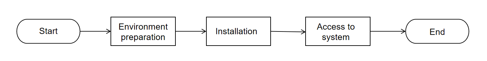

This document describes how to install **DeepSearch**.

To help you get started quickly, the community provides the following installation path:

* **[DeepSearch SDK](./DeepSearch_SDK/README.md)**: Deploy the DeepSearch SDK backend—no web UI. Use via CLI or API. Suited to quick deployment and development on top of DeepSearch.
