DeepSearch是一款知识增强高性能、高精准深度检索与研究引擎。目标是有效利用结构化知识及大模型，融合各种工具，提供企业级Agentic AI 搜索及研究能力。本文介绍了如果使用DeepSearch报告生成的研究任务。  

## 一、准备阶段

> **注意**：本产品提供了前端和后端两套工程，在上手之前需保证前后端工程已部署且运行正常，如未部署工程，请参考**《安装指导》**目录中文档进行部署。

### 1. 获取大模型API Key

DeepSearch的运行依赖大模型服务，可从主流大模型服务提供商购买大模型服务或本地搭建大模型服务。以下流程以华为云为例，介绍大模型服务的获取步骤。

* 点击<a href="https://console.huaweicloud.com/modelarts/?locale=zh-cn&region=cn-southwest-2#/model-studio/deployment" target="_blank" rel="nofollow noopener noreferrer">链接</a>进入华为云模型广场的在线推理模型界面。

* 选择合适的模型，点击“开通服务”。

  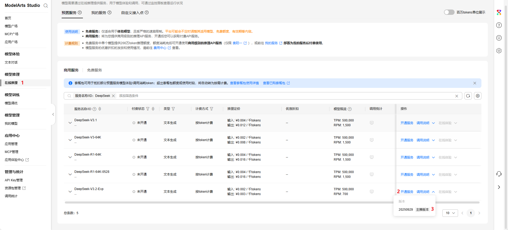

* 开通服务后，点击“调用说明”进入模型信息获取界面。

  

* 点击“OpenAI兼容接口”，记录*API地址*、*model参数*。

* 点击“API Key管理”，按照官方界面引导获取*API Key*。

> 说明：模型获取详细指导请参考 <a href="https://support.huaweicloud.com/usermanual-maas-modelarts/maas-modelarts-0195.html" target="_blank" rel="nofollow noopener noreferrer">华为云官方指导</a>

### 2. 获取web搜索引擎API Key

DeepSearch需要使用web搜索引擎来检索相关信息。用户可以从<a href="https://www.tavily.com/" target="_blank" rel="nofollow noopener noreferrer">Tavily</a>等搜索引擎获取API Key。

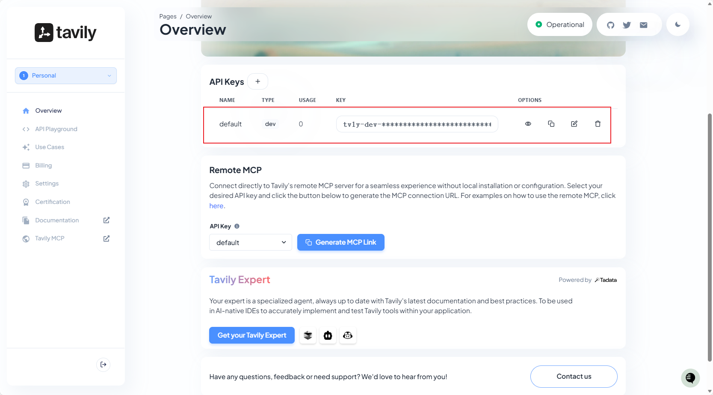

> 说明：Tavily搜索引擎详细指导请参考 <a href="https://docs.tavily.com/documentation/about" target="_blank" rel="nofollow noopener noreferrer">Tavily官方指导</a>

### 3. 模型配置
进入模型管理界面，点击“添加模型”。在模型配置界面中，依次填入`模型名称`、`模型ID`、`API 密钥`、`基础服务地址`以及`描述`。

* **模型名称**​：系统显示名称，用户可自定义。
* **模型ID**​：由模型服务提供商定义的调用名称，可在各提供商的官方网站查询。（对应从华为云获取的*model参数*）
* **API 密钥**：模型的API Key（对应从华为云获取的*API Key*）
* **基础服务地址**：由模型服务提供商定义的API地址，可在各提供商的官方网站查询。（对应从华为云获取的*API地址*）
* **描述**：模型的详细描述，用户可自定义

  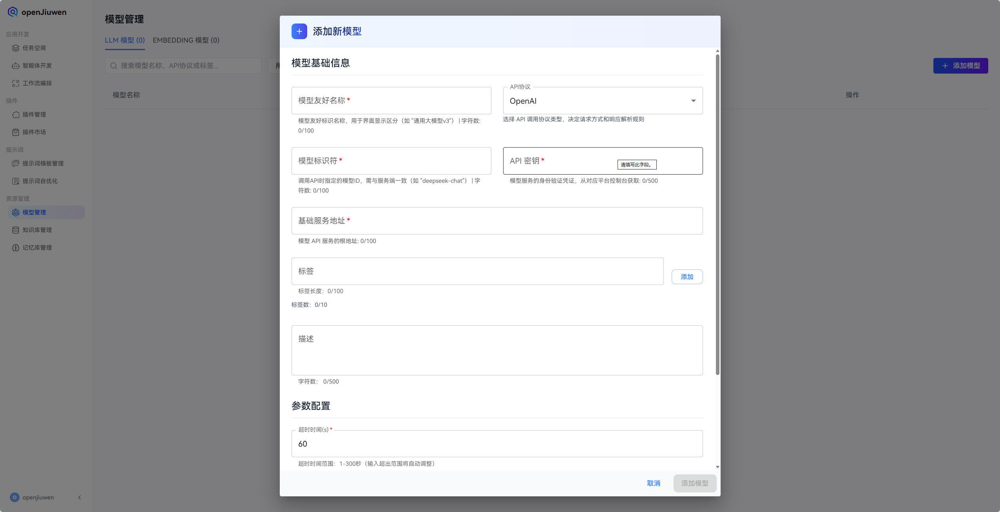
  

openJiuwen 提供了便捷的模型测试功能。

* 在模型管理界面中，点击已添加的模型的测试按钮；

* 选择一个常用测试语句点击；

* 点击开始按钮，稍作等待后输出“测试成功”表示模型配置成功。

  

> 说明：若模型测试失败，请确认提供的模型配置信息是否正确。

## 二、探索应用

### 1. 前置设置

使用 DeepSearch 智能体前，需完成以下设置。

#### 选择智能体

在对话输入框输入 `@DeepSearch` 选择智能体。

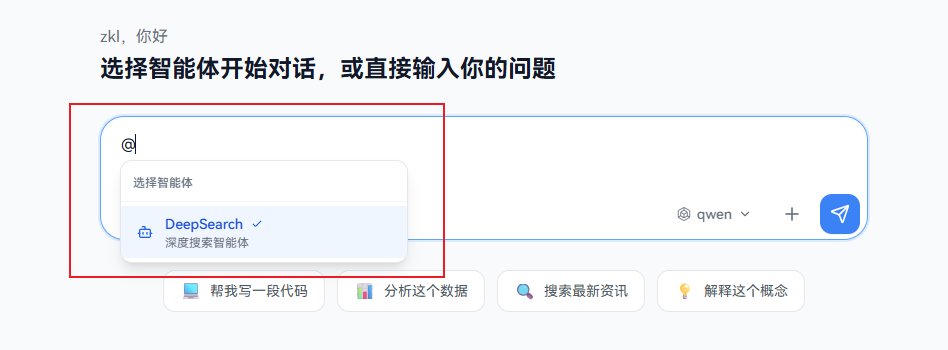

首次选择或配置未完成时，将弹出配置界面，确认后点击"保存配置"即可。

> 说明：保存配置后，DeepSearch 智能体才被激活。

#### 选择模型

在对话界面右上角点击模型选择器，选择已配置的模型。

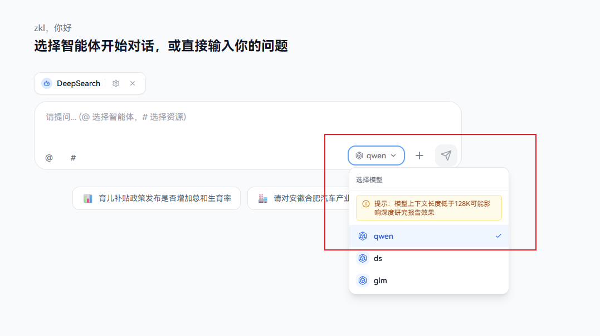

> 说明：使用 DeepSearch 智能体必须选择模型。若模型上下文长度低于 128K，可能影响深度研究报告效果。

#### 智能体配置

点击 DeepSearch 智能体右侧的"配置"按钮进入配置界面。

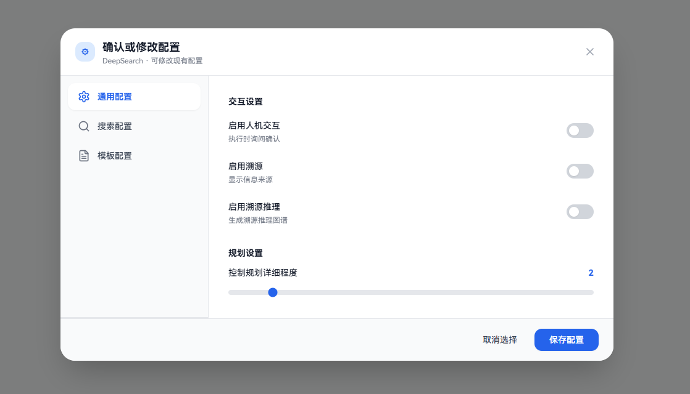

配置界面包含三个标签页，对应不同的功能设置。

> 说明：配置完成后点击"保存配置"应用设置。

#### 通用配置

通用配置包含交互设置和规划设置两部分。

* **人机交互**：开启后，智能体执行过程中会在关键步骤询问确认。
* **信息溯源**：开启后，会在结果中显示信息来源。
* **溯源推理**：开启后，会生成溯源推理图谱。
* **规划章节数量**：控制智能体规划的详细程度，范围 1-10，数值越大规划越详细。

#### 搜索配置

搜索配置包含搜索方式、搜索来源和搜索结果设置。

* **搜索方式**：选择搜索模式
  * **本地搜索**：仅使用本地知识库
  * **网络搜索**：使用网络搜索引擎
  * **综合搜索**：结合本地与网络搜索

* **搜索来源**：根据搜索方式配置对应来源
  * **网络搜索引擎**：点击"配置"添加搜索引擎，支持讯飞搜索、花瓣搜索、Tavily、Google 及自定义引擎。
  * **本地知识库**：点击"配置"选择知识库，支持多选。

* **搜索结果配置**：
  * **网络搜索结果**：网络搜索返回的最大结果数，范围 1-10。
  * **本地搜索结果**：本地搜索返回的最大结果数，范围 1-10。
  * **最小匹配分数**：本地知识库最小匹配分数，范围 0.0-1.0。

#### 模板配置

模板配置用于设置报告输出格式。

* **可用模板**：从模板列表选择报告模板，智能体将按模板格式生成报告。

* **导入新模板**：点击"上传新模板"，基于样例报告抽取模板
  * **提取生成**：从样例报告自动提取模板结构，支持 Markdown、HTML、Word、PDF 格式。
  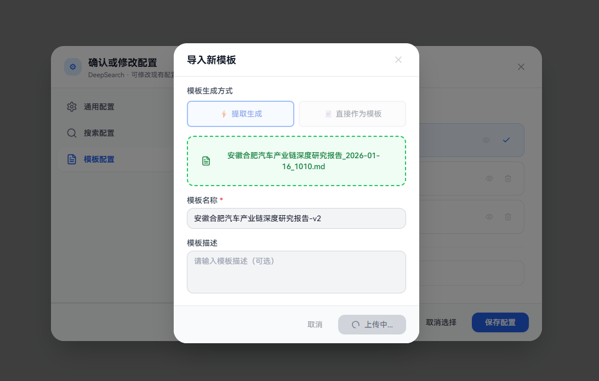
  * **直接作为模板**：直接将 Markdown 文件作为模板使用。
  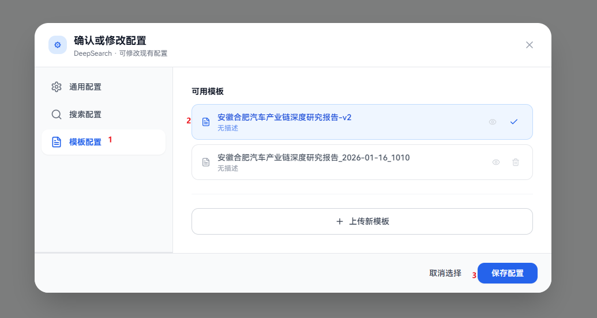

> 说明：模板为可选项，可根据需要选择或导入自定义模板。

### 2. 对话过程
#### 2.1 输入问题进行对话
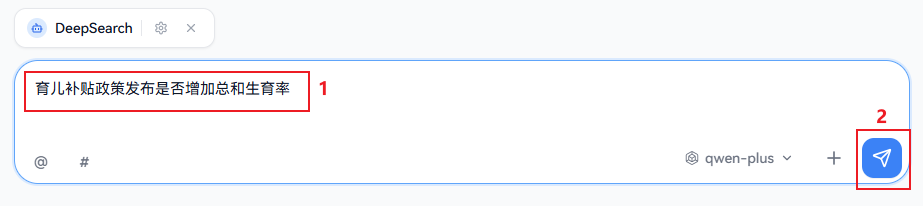

> 说明：用户在红框1中输入问题，点击红框2的发送按钮进行提问。

#### 2.2 消息框详情
##### 2.2.1 消息框各模块说明
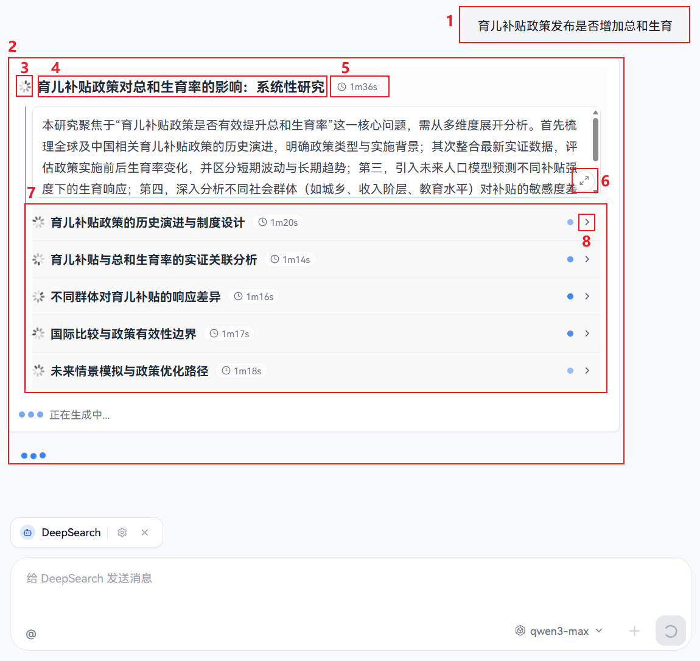

上图是提问后的用户及系统消息框，对各个红框的详细说明如下：
1. **红框1**：用户消息框，显示用户本次提问问题；
2. **红框2**：系统消息框，显示deepsearch本次回复内容；
3. **红框3**：进展标志，表示此模块的进展状态：
   1. 灰色的内部主空的小圆圈，表示未开始;
   2. 灰色转动小菊花动画，表示进行中；
   3. 黑底白勾的标志，表示完成；
   4. 红色的失败标志, 表示失败；
   5. 黄色手动结束标志，表示手动结束；
4. **红框4**：当前章节的标题；
5. **红框5**：本章节的耗时显示, 格式: *d*h*m*s, 其中d/h/m/s分别表示天/时/分/秒
   1. 未完成，数值会实时变化；
   2. 已完成，数值固定不变；
6. **红框6**：文本框的展开按钮，点击后文本框将完全展开；展开后会变化为折叠按钮，可以折叠文本框；
7. **红框7**：用于显示子章节；
8. **红框8**：子章节的展开/折叠按钮，用于展开/折叠子章节；

---
##### 2.2.2 子章节的进展预览图
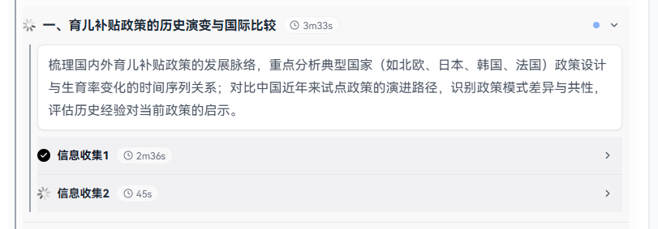

> 说明：上图是子章节的进展预览图。

---
##### 2.2.3 外部引用示意图

  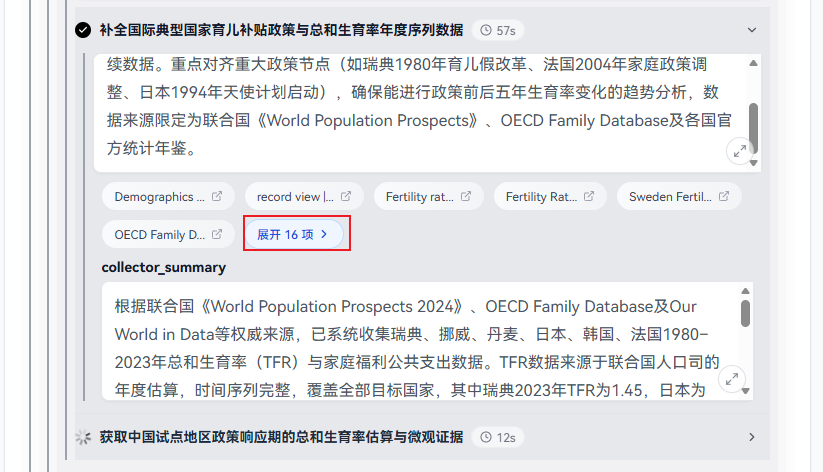
  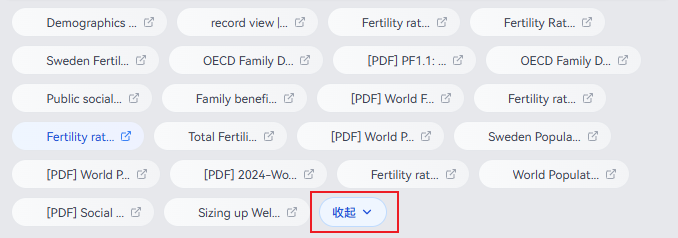

> 说明：上两图分别是外部引用在收起/展开情况下的展示，可通过点击收起/展开按钮进行切换。

---
##### 2.2.4 子章节报告示意图

  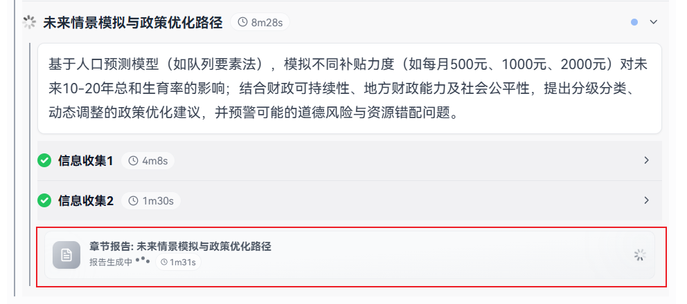
  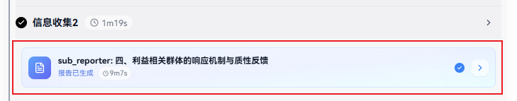

> 上述2图展示了子报告的2种状态： 
> 1. 生成中：灰色主题，显示用时，无法左键点击； 
> 2. 已生成：蓝色主题，显示用时，可左键点击，打开右侧面板显示详情(见下图)；

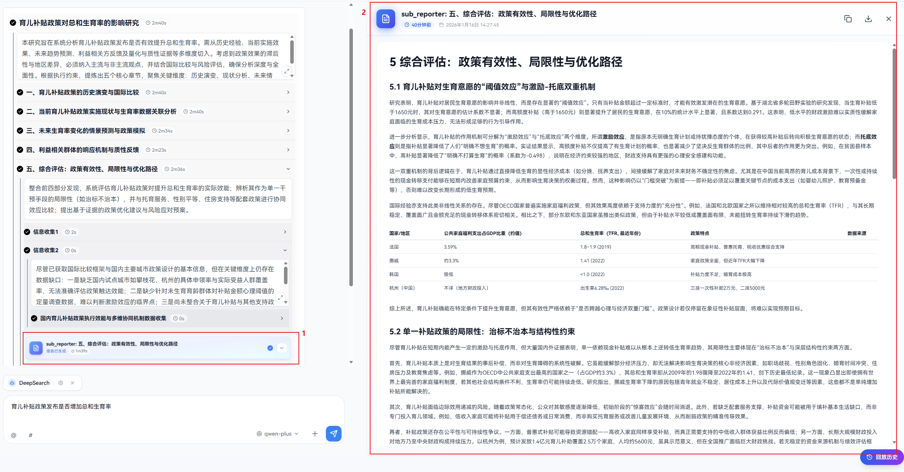

---
##### 2.2.5 最终报告示意图

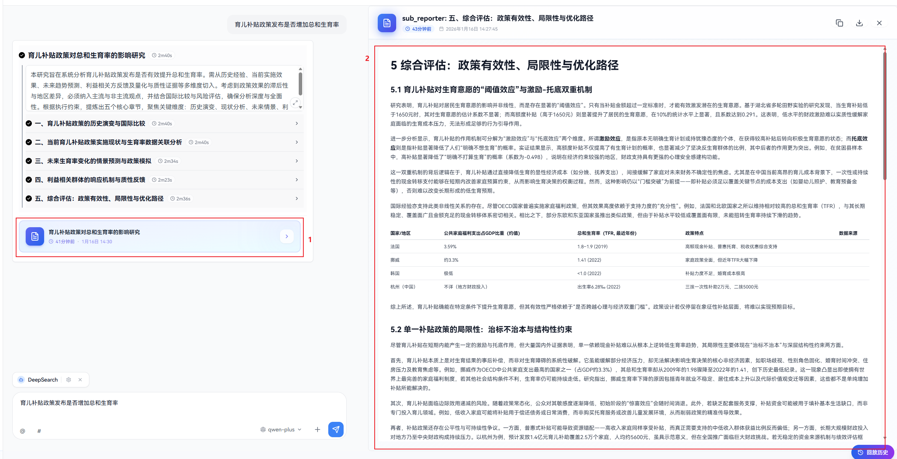

> 说明：上图是deepsearch最终完成后的总效果图，左键点击总报告，可打开右侧详细页。

### 3. 结果显示

在对话过程中，DeepSearch会根据用户输入的问题，利用大模型和web搜索引擎检索相关信息。检索到的信息会被大模型整合，生成符合用户需求的报告，用户可以在界面中查看到最终报告的交互卡片。

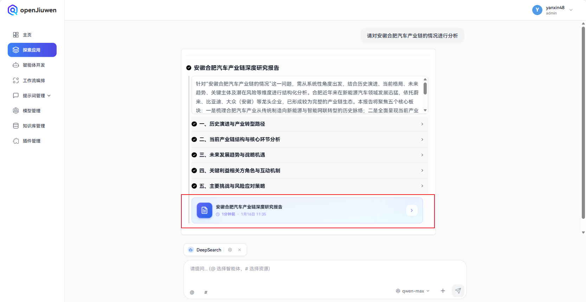

#### 3.1 查看最终报告
鼠标单击最终报告卡片，可以**打开**和**关闭**最终报告的详细内容。

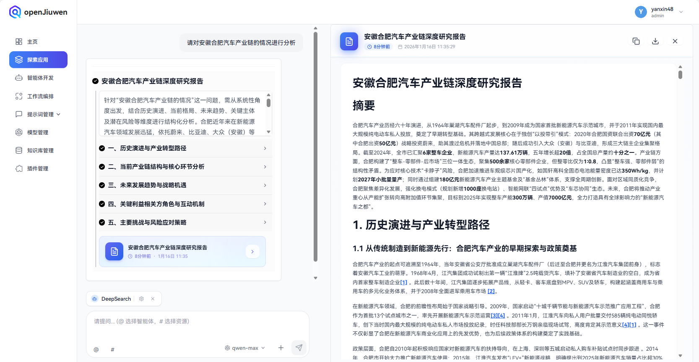

可以通过滚动条查看报告的详细内容。

#### 3.2 查看引用详情

可以点击**[1]**这些引用，点击后可以打开引用的详细信息(如引用片段、来源、可信度等)。同时可以通过点击**web**跳转至引用的来源网页。

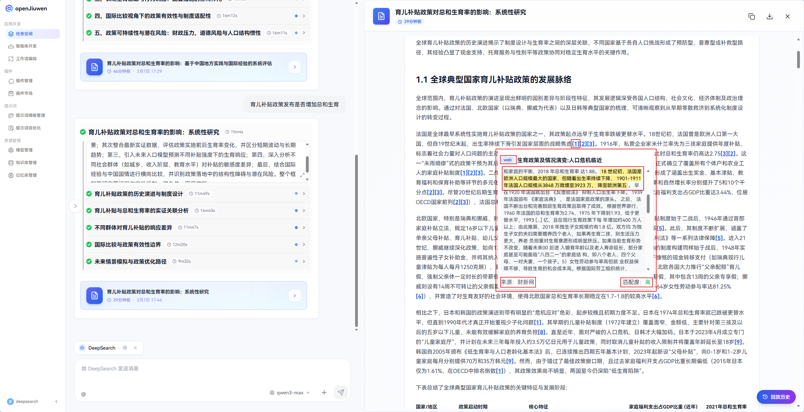

#### 3.3 查看溯源推理图

详细报告中还支持查看**溯源推理图**，展示了模型在生成报告时的推理过程。可以点击链接查看详细推理图。

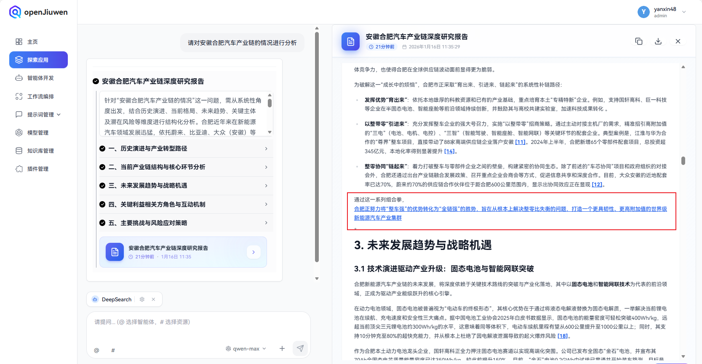

报告的右下角会显示推理图的界面，用户可以在界面中查看推理过程的详细信息。界面支持**放大、缩小和节点拖动**。如果用户需要关闭推理图界面，点击界面右上角的关闭按钮即可。

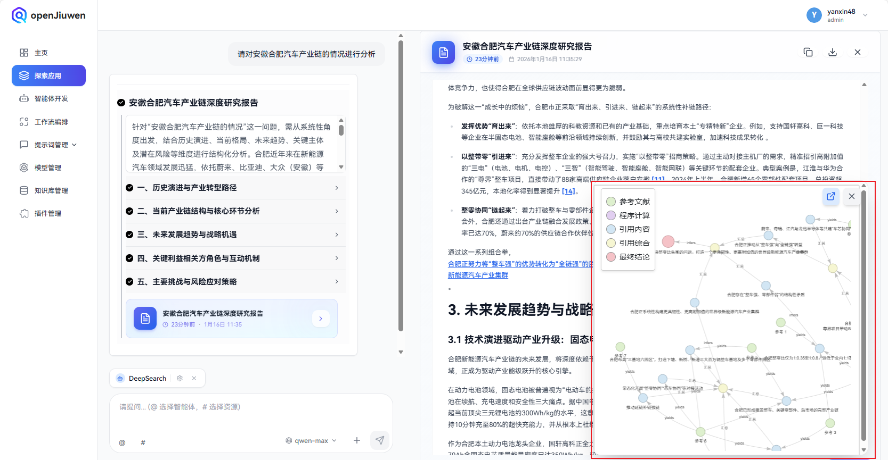

如果用户需要更直观的查看推理过程，建议用户在推理图界面点击**新页签**，将推理图打开在新的页签中查看。

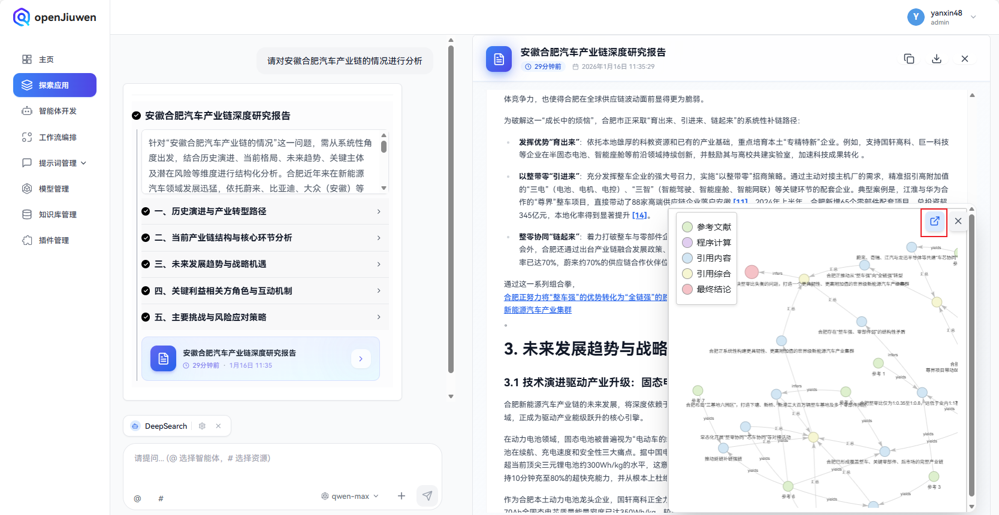

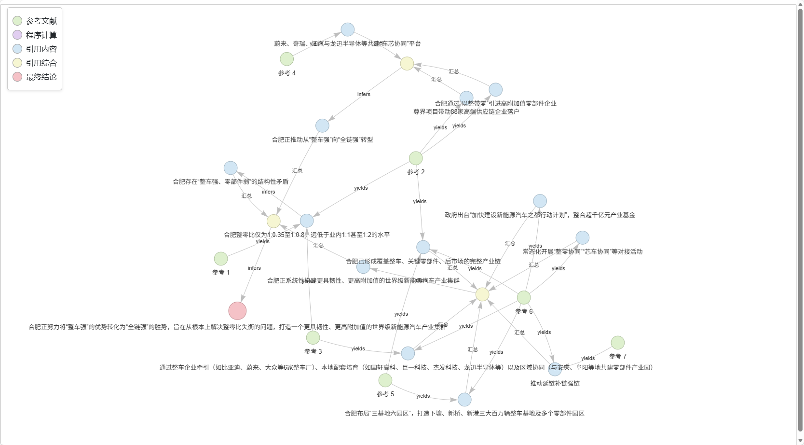

#### 3.4 报告下载
用户可以点击报告界面的**下载**按钮，将报告下载到本地。用户可以在本地查看和分享。

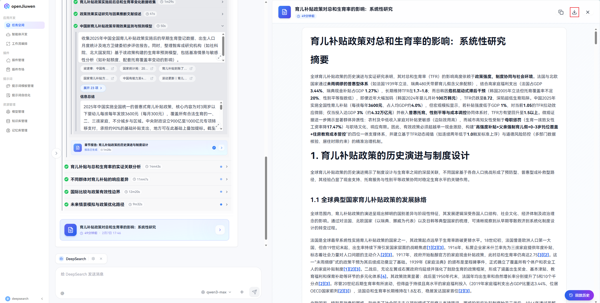

用户可以选择下载报告的格式，目前支持**Markdown**、**DOCS**和**HTML**格式。

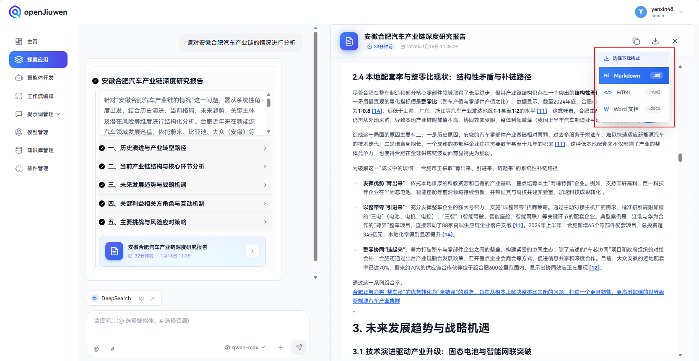

至此，DeepSearch的使用说明已完全介绍完毕。如需探索更多功能特性，可参考《开发指南》与《实践教程》相关内容。